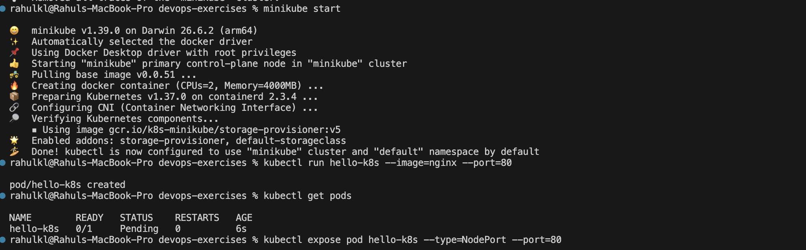
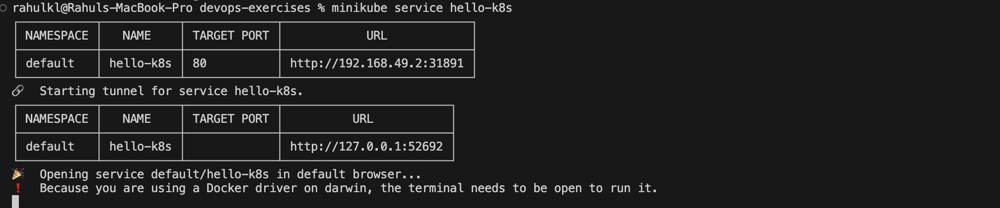
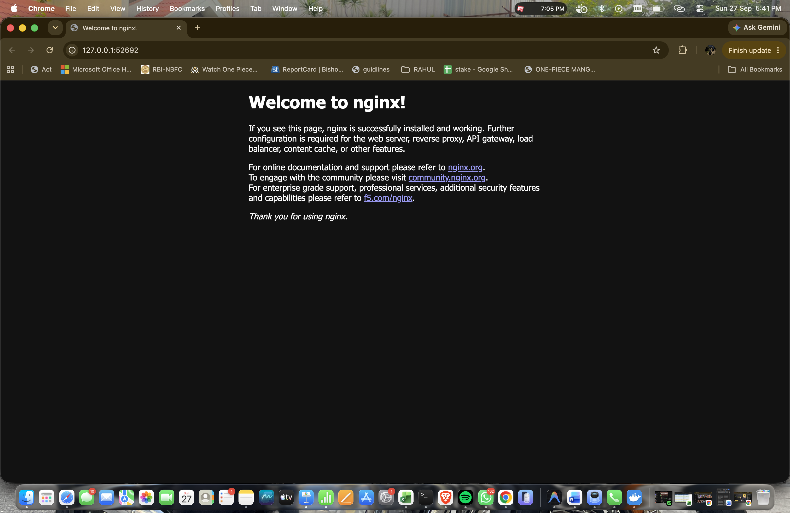

# Kubernetes Hands-On Exercise Series

**Exercise 1: Hello Pod**

This exercise introduces the basics of how Kubernetes runs and manages containerized applications.

## Business Problem (Zepto Example)

Imagine you are a **DevOps Engineer at Zepto**. The product team has built a lightweight **web app** that shows the **storefront and delivery status page** for customers.

Your task as the DevOps engineer:

**Deploy this app on Kubernetes** so that it is always running, portable, and can be scaled later. Simulate this using the popular `nginx` container image (think of it as Zepto's storefront web app).

## Goal

Run your first app inside Kubernetes and access it.

## Pre-Requisites

### Install Minikube and kubectl (macOS, via Homebrew)

```bash
brew install minikube
brew install kubectl
```

> Docker Desktop must be installed and running. Minikube uses the **docker** driver automatically.

## Steps: Deploy Nginx Image as a Pod

**1. Start a local Kubernetes cluster with Minikube:**
```bash
minikube start
```

**2. Create your first Pod (using the Nginx image):**
```bash
kubectl run hello-k8s --image=nginx --port=80
```

**3. Verify the Pod is running:**
```bash
kubectl get pods
```

> **Note:** Right after creation the Pod can show `Pending` or `ContainerCreating` while the image is pulled. Run the command again until `STATUS` is `Running`.

**4. Expose the Pod as a Service:**
```bash
kubectl expose pod hello-k8s --type=NodePort --port=80
```



The screenshot above covers Steps 1 to 4.

**5. Open the app in your browser:**
```bash
minikube service hello-k8s
```



> **Note:** With the Docker driver the terminal running this command must stay open, because it creates the tunnel to the service.

You should see the Nginx welcome page. **Congratulations, you just deployed your first container in Kubernetes!**


