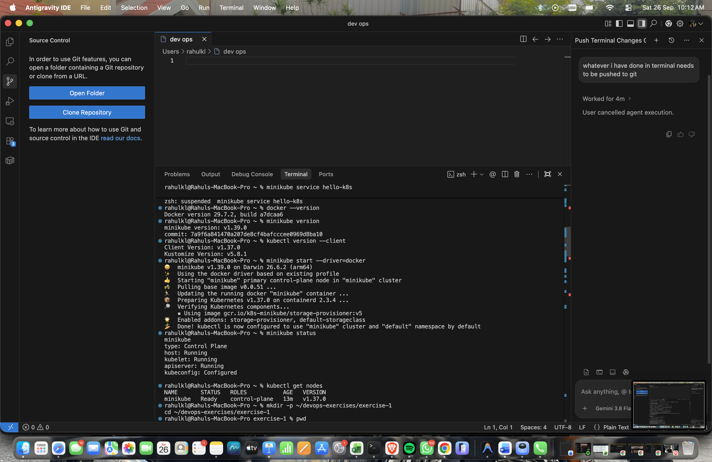
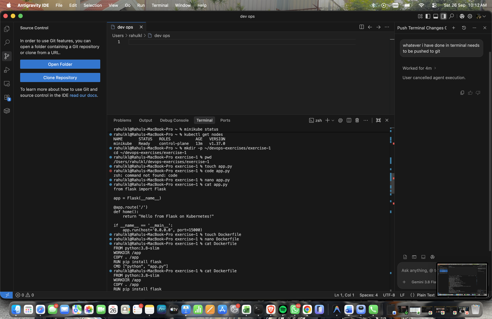
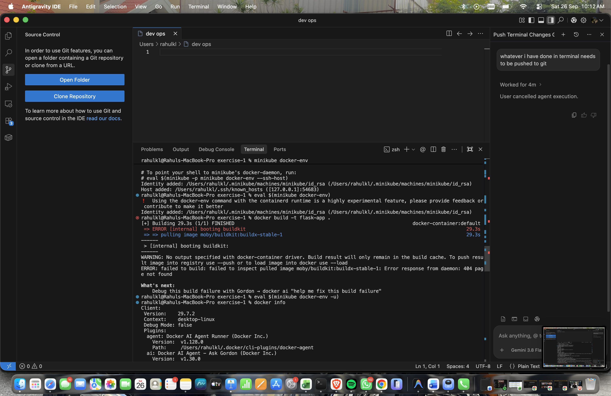
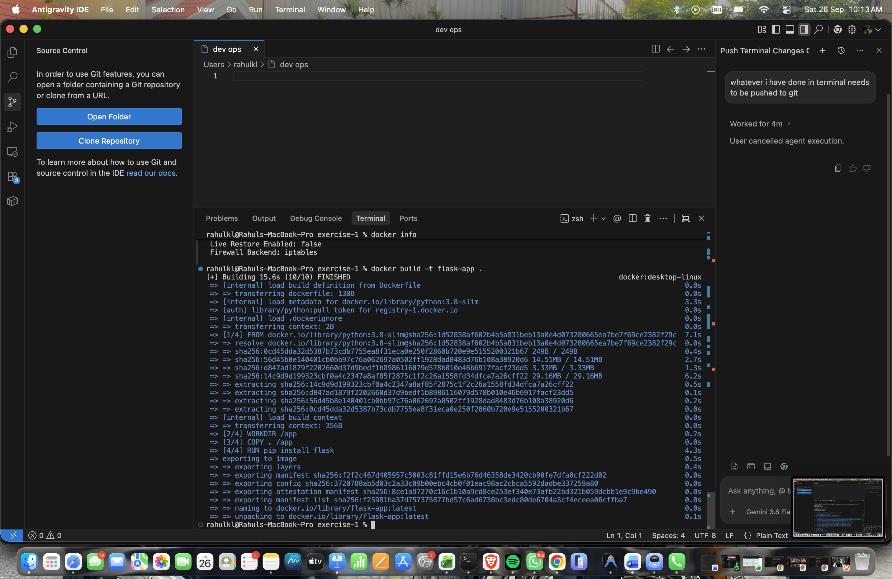
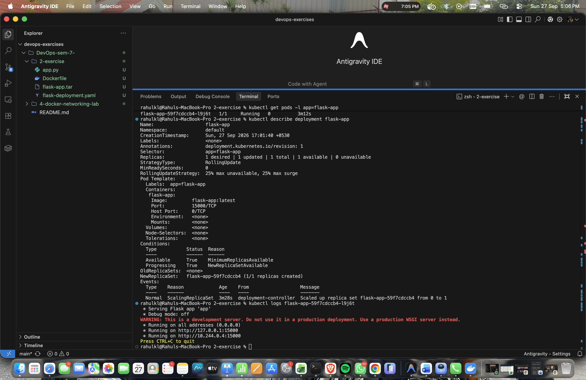
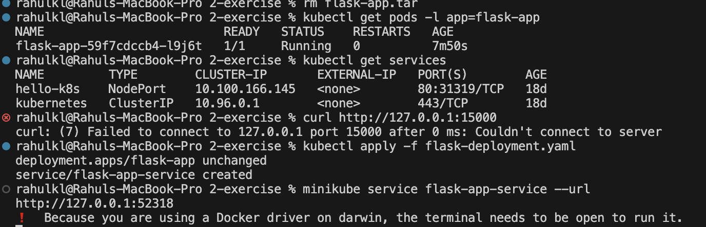
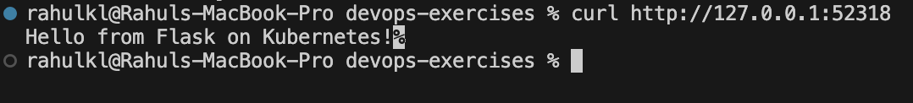

# Exercise 2: Deploy a Flask App on Minikube using kubectl and YAML

## Objective
Learn Kubernetes basics by deploying a Flask application on a single-node Minikube cluster using a Deployment and a NodePort Service, and reach it from the host machine.

## Scenario
A simple Flask web app is containerized with Docker, deployed to Kubernetes with a Deployment manifest, and exposed to the outside world with a Service.

## Step 1: Start Minikube

```bash
minikube start
minikube status
kubectl get nodes
```



## Step 2: Create the Flask app and Dockerfile

`app.py`
```python
from flask import Flask
app = Flask(__name__)

@app.route('/')
def home():
    return "Hello from Flask on Kubernetes!"

if __name__ == '__main__':
    app.run(host='0.0.0.0', port=15000)
```

`Dockerfile`
```dockerfile
FROM python:3.8-slim
WORKDIR /app
COPY . /app
RUN pip install flask
CMD ["python", "app.py"]
```



> **Note:** `host='0.0.0.0'` is required so the app accepts traffic from outside the container.

## Step 3: Build the Docker image

The handout builds the image inside Minikube's Docker daemon:

```bash
eval $(minikube docker-env)
docker build -t flask-app .
```

On macOS (Apple Silicon, Docker driver) this failed while booting BuildKit:



> **Note:** Minikube was using the containerd runtime, so `docker-env` is only experimental and the build failed with `404 page not found`. The workaround is to switch back to Docker Desktop's daemon, build there, and load the image into Minikube.

```bash
eval $(minikube docker-env -u)
docker build -t flask-app .
minikube image load flask-app:latest
```



> **Note:** If you go through a `flask-app.tar` file (`docker save` then `minikube image load`), delete it afterwards and add `*.tar` to `.gitignore` so it is not committed.

## Step 4: Create the Deployment

`flask-deployment.yaml`
```yaml
apiVersion: apps/v1
kind: Deployment
metadata:
  name: flask-app
spec:
  replicas: 1
  selector:
    matchLabels:
      app: flask-app
  template:
    metadata:
      labels:
        app: flask-app
    spec:
      containers:
      - name: flask-app
        image: flask-app:latest
        imagePullPolicy: Never
        ports:
        - containerPort: 15000
```

> **Note:** Kubernetes has three image pull policies: `Always` (always pull from a registry), `IfNotPresent` (pull only if missing locally) and `Never` (only use local images). `Never` makes Kubernetes use the local `flask-app:latest` image instead of trying Docker Hub.

## Step 5: Deploy the application

```bash
kubectl apply -f flask-deployment.yaml
```

## Step 6: Check the deployment and pods

```bash
kubectl get deployments
kubectl get pods -l app=flask-app
```

The Pod `STATUS` should be `Running`.

## Step 7: Describe the deployment

```bash
kubectl describe deployment flask-app
```

This shows the desired and available replicas, the `RollingUpdate` strategy, the Pod template, and events such as `Scaled up replica set flask-app-... from 0 to 1`.

## Step 8: View the logs

```bash
kubectl logs <pod-name>
```



The screenshot above covers Steps 6 to 8. The logs show Flask listening on port 15000, so the app is running.

## Step 9: Try to reach the app (expected to fail)

```bash
kubectl get services
curl http://127.0.0.1:15000
```

```
curl: (7) Failed to connect to 127.0.0.1 port 15000: Couldn't connect to server
```

The curl fails because Minikube runs in an isolated environment and the app's port is only exposed inside the cluster.

## Step 10: Add a Service and re-apply

Append this to `flask-deployment.yaml`:

```yaml
---
apiVersion: v1
kind: Service
metadata:
  name: flask-app-service
spec:
  selector:
    app: flask-app
  ports:
  - port: 15000
    targetPort: 15000
  type: NodePort
```

```bash
kubectl apply -f flask-deployment.yaml
# deployment.apps/flask-app unchanged
# service/flask-app-service created
```

- `port` is the port exposed by the Service
- `targetPort` is the port the container listens on

## Step 11: Access the service

```bash
minikube service flask-app-service --url
```



The screenshot above covers Steps 9 to 11.

> **Note:** With the Docker driver the terminal must stay open. Run the curl from a second terminal.

```bash
curl http://127.0.0.1:52318
# Hello from Flask on Kubernetes!
```



## Step 12: Clean up

```bash
kubectl delete -f flask-deployment.yaml
minikube stop
```

## Q&A

**Q1: What is the purpose of `minikube service flask-app-service --url`?**
A: It checks that the Service is running and prints a URL that can be used to access it.

**Q2: Why is `targetPort` used in a Service?**
A: It specifies the port the container is listening on, so the Service knows where to forward traffic.

**Q3: What is the difference between `port` and `targetPort`?**
A: `port` is the port exposed by the Service; `targetPort` is the port on the container.

**Q4: Why does the terminal need to stay open with the Docker driver?**
A: The command creates a tunnel to the Service, which only exists while the command is running.

**Q5: Why did the first curl to `127.0.0.1:15000` fail?**
A: The app was only exposed inside the cluster. A Service of type NodePort is needed to reach it from the host.

**Q6: Which command exposes a Service?**
A: `kubectl expose ...` or `kubectl apply -f <service.yaml>`.

**Q7: How does Minikube help with local testing?**
A: It runs a single-node Kubernetes cluster locally, so deployments can be tested without a full Kubernetes environment.

**Q8: What is the role of `kubectl`?**
A: It is the Kubernetes CLI used to deploy applications, inspect them, scale them and manage cluster resources.
