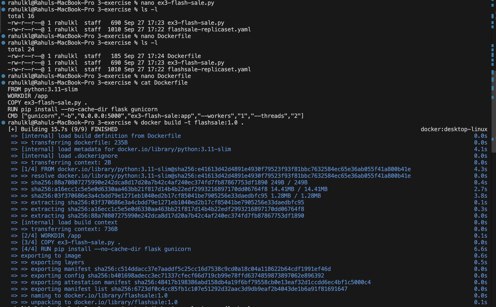
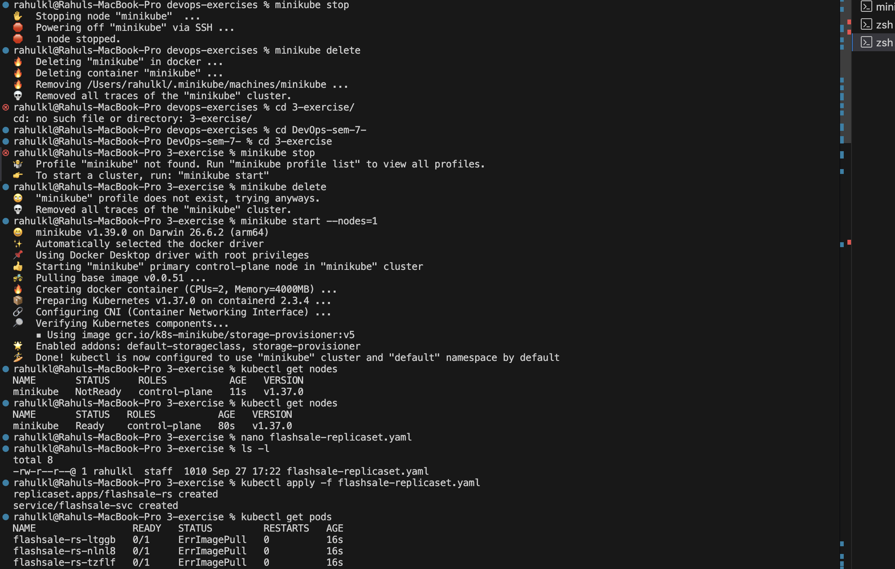
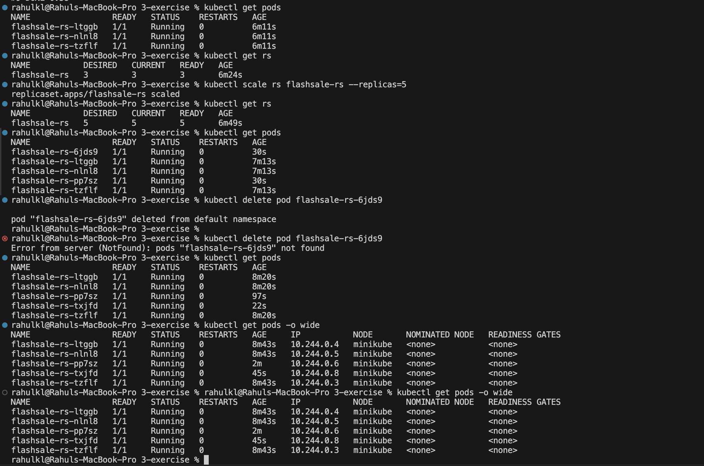

# Exercise 3: Scaling a Flask App on a Single Node using ReplicaSets

## Objective
Understand ReplicaSets and Pods, scale a Flask app up, observe self-healing when a Pod is deleted, and see how Pods are placed on a node.

## Scenario
During an e-commerce flash sale (like Flipkart's Big Billion Days or Amazon Prime Day), traffic can jump from about 100 to 10,000 requests per minute. A single Pod would crash under that load. With a ReplicaSet, the system runs many identical Pods of the same app and distributes requests among them. When the sale ends, it scales back down to save resources.

Key learnings:
- **Pod distribution:** each Pod is an identical worker; scaling means creating clones.
- **Resiliency:** if a Pod fails, the ReplicaSet creates another one automatically.
- **Efficiency:** add Pods when demand spikes and remove them when it drops.

## Step 1: Clean up any previous cluster

```bash
minikube stop
minikube delete
```

## Step 2: Start Minikube with a single node

```bash
minikube start --nodes=1
kubectl get nodes
```

The node should show `Ready` (it can show `NotReady` for the first few seconds).

## Step 3: Create the flash sale app

`ex3-flash-sale.py`
```python
from flask import Flask, request
import socket, time, random

app = Flask(__name__)

@app.get("/")
def homepage():
    return {
        "message": "Welcome to Big Sale!",
        "pod": socket.gethostname(),
        "ts": time.time()
    }

@app.get("/buy")
def buy():
    item = random.choice(["Smartphone", "Shoes", "Headphones", "Laptop"])
    user = request.args.get("user", f"user{random.randint(1,1000)}")
    return {
        "status": "success",
        "item": item,
        "user": user,
        "served_by_pod": socket.gethostname(),
        "time": time.strftime("%H:%M:%S")
    }

@app.get("/health")
def health():
    return {"status": "healthy", "pod": socket.gethostname()}
```

- `/` welcomes users to the Big Sale
- `/buy` simulates a checkout with a random item, or `?user=123`
- `/health` is used by the readiness and liveness probes
- Every response includes the Pod hostname, so load distribution across Pods can be observed

## Step 4: Create the Dockerfile

`Dockerfile`
```dockerfile
FROM python:3.11-slim
WORKDIR /app
COPY ex3-flash-sale.py .
RUN pip install --no-cache-dir flask gunicorn
CMD ["gunicorn","-b","0.0.0.0:5000","ex3-flash-sale:app","--workers","1","--threads","2"]
```

> **Note:** Gunicorn loads `<module>:<flask-object>`. The file is `ex3-flash-sale.py`, so the target is `ex3-flash-sale:app`. If you rename the file to `app.py`, use `app:app` instead. The module name must match the copied filename.

## Step 5: Build the image

```bash
docker build -t flashsale:1.0 .
```



The image must be available inside Minikube, otherwise the Pods cannot start. On Linux or WSL, build against Minikube's Docker daemon:

```bash
eval $(minikube docker-env)
docker build -t flashsale:1.0 .
```

On macOS with Docker Desktop, build normally and load it into Minikube:

```bash
minikube image load flashsale:1.0
```

## Step 6: Create the ReplicaSet and Service

`flashsale-replicaset.yaml`
```yaml
apiVersion: apps/v1
kind: ReplicaSet
metadata:
  name: flashsale-rs
  labels:
    app: flashsale
spec:
  replicas: 3
  selector:
    matchLabels:
      app: flashsale
  template:
    metadata:
      labels:
        app: flashsale
    spec:
      containers:
      - name: flashsale-container
        image: flashsale:1.0
        ports:
        - containerPort: 5000
        readinessProbe:
          httpGet:
            path: /health
            port: 5000
          initialDelaySeconds: 2
          periodSeconds: 5
        livenessProbe:
          httpGet:
            path: /health
            port: 5000
          initialDelaySeconds: 10
          periodSeconds: 10
        resources:
          requests:
            cpu: "100m"
            memory: "128Mi"
          limits:
            cpu: "500m"
            memory: "256Mi"
---
apiVersion: v1
kind: Service
metadata:
  name: flashsale-svc
spec:
  selector:
    app: flashsale
  ports:
  - name: http
    port: 80
    targetPort: 5000
  type: ClusterIP
```

- `replicas: 3` is the number of Pod copies to keep running
- `readinessProbe` means a Pod only receives traffic once `/health` responds
- `livenessProbe` restarts a Pod if `/health` stops responding
- `resources` reserves CPU and memory (requests) and caps them (limits)
- The Service on port 80 forwards to container port 5000 and load-balances across the Pods

## Step 7: Apply the ReplicaSet

```bash
kubectl apply -f flashsale-replicaset.yaml
```

```
replicaset.apps/flashsale-rs created
service/flashsale-svc created
```



The screenshot above also covers Steps 1 and 2.

> **Note:** In this run the manifest was applied before the image had been loaded into Minikube, so the Pods first showed `ErrImagePull`. They started normally once the image was available. Building the image first (Step 5) avoids this.

## Step 8: Verify the Pods and the ReplicaSet

```bash
kubectl get pods
kubectl get rs
```

All 3 Pods should be `Running`, and the ReplicaSet should show `DESIRED 3`, `CURRENT 3`, `READY 3`.

## Step 9: Scale the ReplicaSet to 5 replicas

```bash
kubectl scale rs flashsale-rs --replicas=5
kubectl get rs
kubectl get pods
```

Kubernetes creates 2 additional Pods to reach 5.

## Step 10: Delete a Pod

```bash
kubectl delete pod <pod-name>
kubectl get pods
```

The ReplicaSet immediately creates a replacement Pod, so the count stays at 5.

## Step 11: View Pod placement

```bash
kubectl get pods -o wide
```



The screenshot above covers Steps 8 to 11. All 5 Pods run on the single `minikube` node, each with its own IP.

## Step 12: Clean up

```bash
kubectl delete -f flashsale-replicaset.yaml
minikube stop
```

## Additional Challenges
- Change the ReplicaSet to use a different image.
- Create a Deployment instead of a ReplicaSet and compare the two.
- Use `kubectl describe rs flashsale-rs` and `kubectl describe pod <pod-name>` to inspect events.
- Use `kubectl logs <pod-name>` and `kubectl exec -it <pod-name> -- sh` to look inside a Pod.

## Q&A

**Q1: What is the initial number of replicas in the ReplicaSet?**
A: 3.

**Q2: How many Pods are running after applying the ReplicaSet?**
A: 3.

**Q3: What happens when you scale the ReplicaSet to 5 replicas?**
A: Kubernetes creates 2 additional Pods to meet the desired count of 5.

**Q4: What happens when you delete one Pod?**
A: The ReplicaSet automatically creates a replacement to maintain the desired number of replicas.

**Q5: How does Kubernetes maintain the desired number of replicas?**
A: A controller continuously compares the number of running Pods with the desired count and creates or deletes Pods to close the gap.

**Q6: How many nodes are running, and where are the Pods?**
A: One node (`minikube`), and all 5 Pods run on it.

**Q7: Why did the Pods show `ErrImagePull` at first?**
A: The image `flashsale:1.0` did not yet exist inside Minikube. Once it was loaded, the Pods started.
